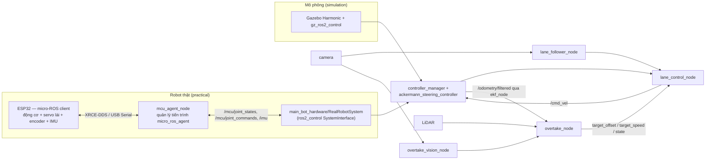
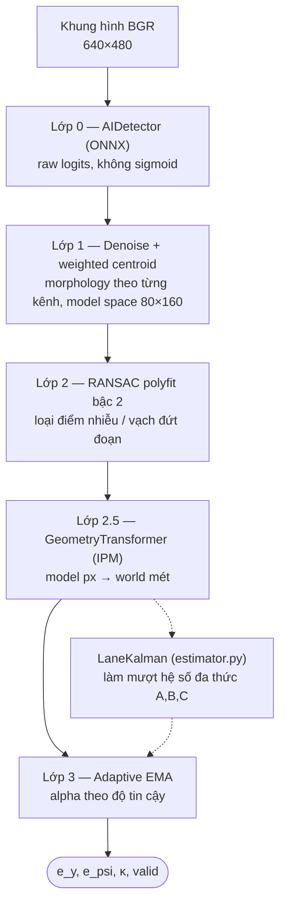
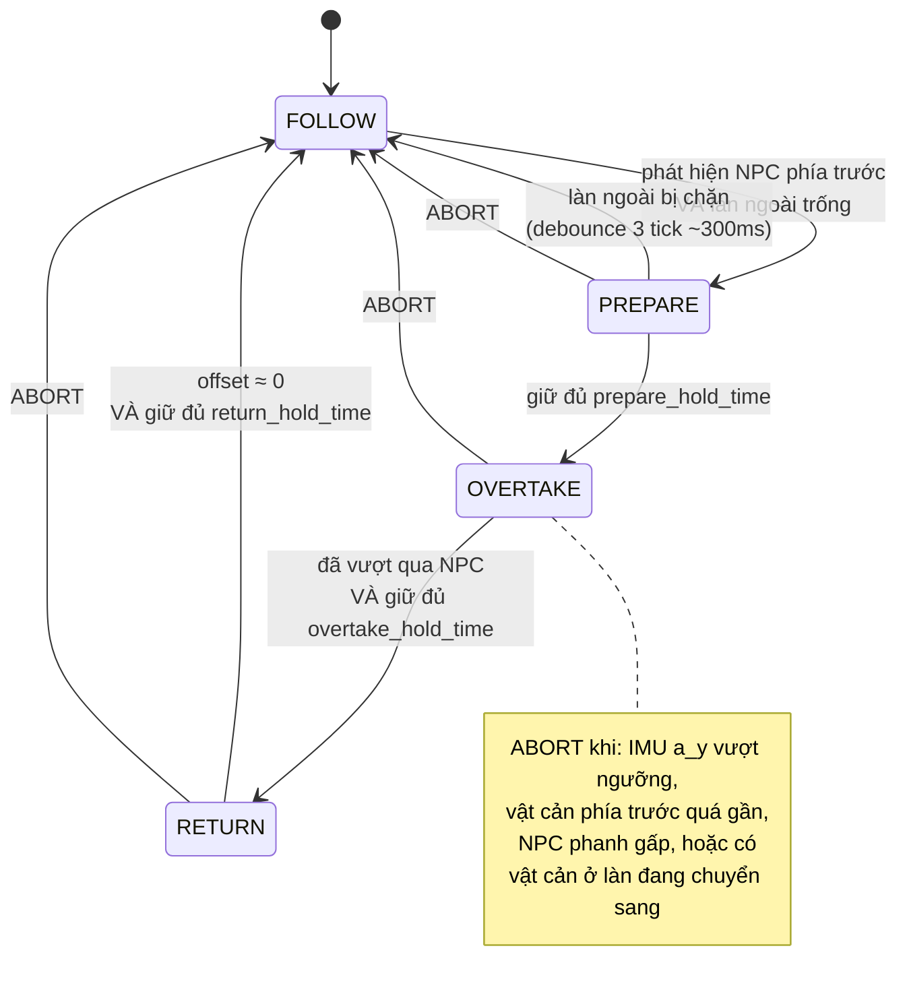

<div align="center">

# 🚗 LKAS — Lane Keeping & Overtake Assist System

**Hệ thống giữ làn đường và vượt xe tự động cho robot Ackermann — chạy được cả mô phỏng lẫn robot thật**

[](https://docs.ros.org/en/jazzy/)
[](https://gazebosim.org/)
[](https://micro.ros.org/)
[](#)
[](#)
[](#)

</div>

---

## Mục lục

- [Tổng quan](#tổng-quan)
- [Tính năng chính](#tính-năng-chính)
- [Mô phỏng & Robot thật — 1 codebase, 2 chế độ](#mô-phỏng--robot-thật--1-codebase-2-chế-độ)
- [Kiến trúc hệ thống](#kiến-trúc-hệ-thống)
- [Pipeline thị giác — giữ làn](#pipeline-thị-giác--giữ-làn)
- [Pipeline vượt xe — 7 lớp](#pipeline-vượt-xe--7-lớp)
- [Các package trong workspace](#các-package-trong-workspace)
- [Cấu trúc thư mục](#cấu-trúc-thư-mục)
- [Thông số robot & thế giới mô phỏng](#thông-số-robot--thế-giới-mô-phỏng)
- [Bắt đầu nhanh](#bắt-đầu-nhanh)
- [Chạy trên robot thật](#chạy-trên-robot-thật)
- [Tham số có thể tinh chỉnh](#tham-số-có-thể-tinh-chỉnh)
- [Ghi chú thiết kế quan trọng](#ghi-chú-thiết-kế-quan-trọng)
- [Giấy phép](#giấy-phép)

---

## Tổng quan

**LKAS** là một workspace ROS 2 mô phỏng — và điều khiển thật — một robot 4 bánh dẫn động kiểu
Ackermann có khả năng:

1. **Tự lái theo làn đường** bằng camera + mô hình phân đoạn làn đường chạy ONNX, dùng bộ điều khiển Stanley kết hợp feed-forward độ cong.
2. **Tự động vượt xe (NPC)** phía trước bằng cách hợp nhất dữ liệu LiDAR 2D, IMU, odometry (qua EKF) và camera, điều phối qua một state machine 7 lớp.

Cùng một bộ node điều khiển (`lane_control_node`, `overtake_node`, các node vision) chạy **không đổi**
trên cả Gazebo Harmonic (đường đua oval 2 làn, NPC chuyển động độc lập để kiểm thử kịch bản vượt xe)
lẫn robot Ackermann thật, giao tiếp phần cứng qua micro-ROS.

## Tính năng chính

- 🎯 **Giữ làn bằng AI**: mô hình segmentation nhẹ (`EgoLanes_Lite_FP32.onnx`) chạy qua ONNX Runtime, không phụ thuộc `cv_bridge`.
- 📐 **Inverse Perspective Mapping (IPM) thuần hình học**: chuyển pixel ảnh sang toạ độ mét không cần bảng tra hay calibration ngoài.
- 🧭 **Bộ lọc Kalman trên hệ số đa thức làn đường**, mượt hoá `e_y`, `e_psi` qua từng khung hình và dự đoán khi mất dấu tạm thời.
- 🛞 **Bộ điều khiển Stanley + feed-forward** với blend độ cong từ odometry (EKF) và từ camera.
- 🚦 **State machine vượt xe 4 trạng thái** (`FOLLOW → PREPARE → OVERTAKE → RETURN`) với logic abort an toàn (va chạm, IMU spike, xe ngược chiều).
- 👁️ **Fusion cảm biến**: LiDAR cho khoảng cách/an toàn chính xác, camera bổ sung tầm phát hiện xa cho vật cản phía trước.
- 🤖 **NPC có vật lý va chạm thật** (mô phỏng): dùng plugin `VelocityControl` của Gazebo thay vì chỉ dịch chuyển pose, nên robot có thể va chạm với NPC như một vật thể thật.
- 🔌 **1 kiến trúc — 2 chế độ**: `ros2_control` trừu tượng hoá phần cứng, nên toàn bộ tầng ứng dụng không cần biết đang chạy trên Gazebo hay robot thật.
- 🖥️ **GUI điều khiển mô phỏng** (package `gui`): launch/stop Gazebo, xem `e_y`/`e_psi` real-time, xem camera debug — không cần dòng lệnh.

## Mô phỏng & Robot thật — 1 codebase, 2 chế độ

Mỗi thư mục cấu hình của `main_bot` (`launch/`, `config/`, và khối `ros2_control` trong
`description/`) có 2 biến thể song song:

| | `simulation/` | `practical/` |
|---|---|---|
| Vật lý / phần cứng | Gazebo Harmonic (`gz_ros2_control`) | Robot thật qua `main_bot_hardware/RealRobotSystem` |
| Cảm biến | Camera + LiDAR + IMU mô phỏng trong Gazebo | Camera + LiDAR thật (driver riêng) · IMU đọc bởi ESP32 |
| Giao tiếp động cơ/servo | Plugin Gazebo trực tiếp | micro-ROS qua package `mcu_agent` |
| Launch chính | [`launch/simulation/gazebo.launch.py`](src/main_bot/launch/simulation/gazebo.launch.py) | [`launch/practical/robot.launch.py`](src/main_bot/launch/practical/robot.launch.py) |

**Không đổi giữa 2 chế độ**: `lane_control_node`, `overtake_node`, `lane_follower_node`,
`overtake_vision_node`, `ackermann_steering_controller`, và toàn bộ hình học vật lý trong
`description/` (chassis, camera, IMU, LiDAR — dùng chung 1 file cho cả 2 chế độ, chỉ khối
`<gazebo><sensor>` bị tắt khi `sim_mode:=false`).

## Kiến trúc hệ thống



> `overtake_node` chỉ dùng vision để **bổ sung tầm phát hiện xa** cho vật cản phía trước.
> Khoảng trống làn ngoài (`adj_clear`) luôn được quyết định bằng LiDAR để tránh camera nhìn thẳng
> gây báo sai khi NPC/xe khác chạy song song ở làn ngoài.

## Pipeline thị giác — giữ làn

`lane_follower_node.py` gọi `LaneProcessor` ([`vision/processor.py`](src/main_bot/scripts/vision/processor.py)) trên từng khung hình:



| Đại lượng | Ý nghĩa | Đơn vị |
|---|---|---|
| `e_y` | Sai số ngang (lệch tâm làn) | m |
| `e_psi` | Sai số góc hướng | rad |
| `kappa` | Độ cong đường tại vị trí robot | 1/m |
| `valid` | EMA đang hoạt động tin cậy | bool |

Kết quả được publish lên `/status_err` (`geometry_msgs/Vector3`: `x=e_y, y=e_psi, z=kappa`) cho `lane_control_node`, đồng thời `overtake_vision_node` cũng lắng nghe `kappa` để bù góc nhìn camera trên khúc cua.

## Pipeline vượt xe — 7 lớp

`overtake_node` (C++) điều phối 3 module: `SafetyMonitor` (Lớp 1‑3, 6‑7), `StateMachine` (Lớp 4), `OffsetPlanner` (Lớp 5).



| Lớp | Module | Vai trò |
|---|---|---|
| 1 | Sensor fusion | LiDAR + IMU + odometry → khoảng cách, curvature, vận tốc |
| 2‑3 | `SafetyMonitor::run()` | Front sector, adjacent sector, gap time, same-lane distance |
| 4 | `StateMachine::update()` | `FOLLOW → PREPARE → OVERTAKE → RETURN` |
| 5 | `OffsetPlanner::step()` | Rate-limit độ dịch ngang mục tiêu (`target_offset`) |
| 6‑7 | `SafetyMonitor::check_abort()` | Phát hiện nguy hiểm, ép về `FOLLOW` |

`overtake_node` publish `/overtake/target_offset`, `/overtake/target_speed`, `/overtake/state` — `lane_control_node` cộng `target_offset` vào sai số `e_y` và áp `target_speed` thay cho tốc độ mặc định trong lúc vượt.

## Các package trong workspace

| Package | Ngôn ngữ | Vai trò |
|---|---|---|
| [`main_bot`](src/main_bot) | C++ / Python | Toàn bộ pipeline giữ làn + vượt xe, mô tả robot (URDF/xacro), launch sim & thật, plugin `ros2_control` cho robot thật |
| [`mcu_agent`](src/mcu_agent) | C++ | Quản lý tiến trình micro-ROS Agent, cầu nối ESP32 ↔ ROS 2 topics cho robot thật |
| [`gui`](src/gui) | Python (PyQt5) | Bảng điều khiển mô phỏng: launch/stop Gazebo, biểu đồ `e_y`/`e_psi` real-time, xem camera debug |

## Cấu trúc thư mục

```
LKAS/
└── src/
    ├── main_bot/
    │   ├── src/lane_control_node.cpp        # Stanley + feed-forward + κ-blend controller
    │   ├── overtake/
    │   │   ├── ov_inc/                      # Header: SafetyMonitor, StateMachine, OffsetPlanner
    │   │   └── ov_src/                      # Implementation + overtake_node.cpp (entry point)
    │   ├── hardware/                        # ros2_control plugin cho robot thật
    │   │   ├── include/main_bot_hardware/real_robot_system.hpp
    │   │   ├── real_robot_system.cpp        # SystemInterface: /mcu/joint_states ↔ /mcu/joint_commands
    │   │   └── main_bot_hardware.xml        # pluginlib export
    │   ├── worlds/
    │   │   ├── npc/npc_driver_node.cpp      # Spawn & lái NPC quanh đường oval (sim)
    │   │   └── race_way.world               # Thế giới Gazebo: đường đua 2 làn
    │   ├── scripts/
    │   │   ├── lane_follower_node.py        # Cầu nối camera → vision pipeline → /status_err
    │   │   ├── overtake_vision_node.py      # Nhận diện NPC bằng màu (HSV) qua camera
    │   │   ├── odom_tf_relay.py             # (legacy) relay TF — đã thay bằng publish_tf của EKF
    │   │   └── vision/                      # ai_detector / processor / estimator / transformer
    │   ├── description/                     # URDF/xacro — DÙNG CHUNG cho sim & thật
    │   │   ├── robot.urdf.xacro             # xacro:arg sim_mode chọn nhánh ros2_control
    │   │   ├── camera.xacro, imu.xacro, lidar.xacro, robot_core.xacro, inertial.xacro
    │   │   ├── simulation/ros2_control.xacro    # plugin=gz_ros2_control/GazeboSimSystem
    │   │   └── practical/ros2_control.xacro     # plugin=main_bot_hardware/RealRobotSystem
    │   ├── config/
    │   │   ├── simulation/                  # controller_gz_sim.yaml, ekf.yaml, gz_bridge.yaml
    │   │   └── practical/                   # controller_real.yaml, ekf.yaml
    │   ├── launch/
    │   │   ├── simulation/                  # gazebo.launch.py, manual_test_sim.launch.py, display.launch.py, test_world.launch.py
    │   │   └── practical/                   # robot.launch.py (tự hành), manual_test_real.launch.py (joystick, không autonomous)
    │   └── models/EgoLanes_Lite_FP32.onnx   # Model segmentation làn đường
    │
    ├── mcu_agent/                           # Xem mcu_agent/README.md cho hợp đồng topic MCU
    │   ├── include/mcu_agent/agent_supervisor.hpp
    │   ├── src/{agent_supervisor,mcu_agent_node}.cpp
    │   ├── launch/mcu_agent.launch.py
    │   └── scripts/setup_micro_ros_agent.sh # build 1 lần micro-ROS Agent gốc (không tự chạy)
    │
    └── gui/gui/control_gui.py                # PyQt5 control panel — sim/real x auto/manual
```

## Thông số robot & thế giới mô phỏng

<table>
<tr><td valign="top">

**Khung gầm (Ackermann)**

| Thông số | Giá trị |
|---|---|
| Kích thước chassis | 0.297 × 0.158 × 0.062 m |
| Khối lượng | 2.0 kg |
| Chiều dài cơ sở (wheelbase) | 0.21 m |
| Track width | 0.217 m |
| Bán kính bánh xe | 0.05 m |
| Giới hạn góc lái | ±0.52 rad (≈ ±30°) |

</td><td valign="top">

**Camera**

| Thông số | Giá trị |
|---|---|
| Độ phân giải | 640 × 480 |
| FOV ngang | 2.094 rad (120°) |
| Chiều cao lắp | 0.134 m |
| Offset theo X | 0.1485 m |
| Pitch | 0 rad (nhìn thẳng) |

</td></tr>
<tr><td valign="top">

**LiDAR 2D**

| Thông số | Giá trị |
|---|---|
| Số tia | 360 (toàn vòng 360°) |
| Tần số | 20 Hz |
| Tầm đo | 0.15 – 4.0 m |

</td><td valign="top">

**Đường đua & làn (mô phỏng)**

| Thông số | Giá trị |
|---|---|
| Dạng | Oval, 2 đoạn thẳng dài 12 m |
| Làn trong (`lane_y`) | 2.267 m |
| Làn ngoài (`lane_y`) | 2.801 m |
| Độ rộng nửa làn | 0.267 m |

</td></tr>
</table>

## Bắt đầu nhanh

```bash
# 1. Build toàn bộ workspace
source /opt/ros/jazzy/setup.bash
colcon build
source install/setup.bash

# 2. Khởi chạy mô phỏng (Gazebo + tất cả node) — bằng dòng lệnh...
ros2 launch main_bot gazebo.launch.py

# ...hoặc bằng GUI (package gui) — chọn SIMULATION/REAL ROBOT và Autonomous/Manual trong app:
ros2 run gui control_gui

# 3. (tuỳ chọn) Mở RViz để quan sát TF / debug image
ros2 launch main_bot display.launch.py
```

> Lưu ý: `ros2 launch main_bot <tên_file>.launch.py` dùng **tên file trần** (không kèm đường dẫn
> `simulation/`/`practical/`) — `ros2 launch` tự tìm đệ quy trong `share/main_bot/`, và mỗi file có
> tên duy nhất trong toàn bộ package nên không bị nhầm lẫn.

Sau khi chạy, có thể theo dõi các topic quan trọng:

```bash
ros2 topic echo /overtake/state          # FOLLOW / PREPARE / OVERTAKE / RETURN
ros2 topic echo /status_err              # e_y, e_psi, kappa từ vision
ros2 run rqt_image_view rqt_image_view   # xem /processed_image, /overtake/vision_debug
```

## Chạy trên robot thật

**Đã xác nhận chạy được end-to-end trên phần cứng thật**, bao gồm cả lane-keeping tự hành —
xem [README gốc](../README.md#trạng-thái-dự-án) cho trạng thái chi tiết. Firmware ESP32 đã có sẵn
tại [`esp32-for-lkas/`](../esp32-for-lkas/), không cần tự viết lại.

```bash
# 1. Build 1 lần micro-ROS Agent gốc (clone + build ngoài workspace chính, xem
#    src/mcu_agent/README.md). Có thể mất vài phút, cần mạng + có thể cần sudo.
bash src/mcu_agent/scripts/setup_micro_ros_agent.sh

# 2. Build + nạp firmware cho ESP32 (xem README gốc, mục "Bắt đầu nhanh")
cd ../esp32-for-lkas && pio run -t upload && cd ../LKAS

# 3a. Bringup robot thật — tự hành, bằng dòng lệnh...
source install/setup.bash
ros2 launch main_bot robot.launch.py serial_port:=/dev/ttyACM0 baud_rate:=115200

# 3b. ...hoặc bằng GUI: ros2 run gui control_gui, chọn REAL ROBOT.
#     Khuyến nghị chạy submode Manual (Joystick) trước để test tay drivetrain
#     (không tranh chấp /cmd_vel với pipeline tự lái), rồi mới chuyển Autonomous.
```

`robot.launch.py` khởi động: `robot_state_publisher` (URDF với `sim_mode:=false`),
`controller_manager` (nạp `main_bot_hardware/RealRobotSystem`), `ackermann_steering_controller`,
`ekf_node`, `mcu_agent_node`, rồi đúng 4 node ứng dụng dùng chung với mô phỏng.

> ⚠️ Node driver camera/LiDAR thật trong
> [`launch/practical/robot.launch.py`](src/main_bot/launch/practical/robot.launch.py) hiện vẫn chỉ
> có ví dụ dạng comment (`v4l2_camera` / `rplidar_ros`) — cần rà soát và commit chính thức node đang
> dùng thực tế vào file này.

## Tham số có thể tinh chỉnh

Tất cả tham số dưới đây có thể chỉnh qua `ros2 param set` khi node đang chạy (không cần build lại), hoặc sửa mặc định trong file `.launch.py` / node tương ứng.

<details>
<summary><b>lane_control_node</b> — Stanley + feed-forward</summary>

| Tham số | Mặc định | Sim override | Ý nghĩa |
|---|---|---|---|
| `speed` | 8.0 | 1.0 | Tốc độ tiến mục tiêu (m/s) |
| `k` | 0.30 | 1.0 | Hệ số Stanley cho `e_y` |
| `max_steer` | 0.52 | 0.52 | Giới hạn góc lái (rad) |
| `alpha` / `alpha_conv` | 0.40 / 0.70 | — | EMA output khi tăng / khi giảm (bất đối xứng) |
| `k_ff` | 1.00 | — | Hệ số feed-forward độ cong |
| `lookahead_x` | 0.923 | — | Điểm nhìn trước dùng tách curvature khỏi `e_psi` |
| `kappa_blend` | 0.60 | **0.85** | Tỉ trọng κ từ odometry so với vision |

</details>

<details>
<summary><b>overtake_node</b> — SafetyMonitor / StateMachine / OffsetPlanner</summary>

| Tham số | Mặc định | Sim override | Ý nghĩa |
|---|---|---|---|
| `front_detect_range` | 3.0 | 1.0 | Tầm phát hiện NPC phía trước (m) |
| `front_safe_min` | 0.40 | 0.35 | Khoảng cách an toàn tối thiểu (m) |
| `front_sector_deg` | 30.0 | 21.5 | Nửa góc sector phía trước (độ) |
| `adjacent_clear_min` | 0.50 | 0.30 | Ngưỡng trống của làn ngoài (m) |
| `gap_time_threshold` | 4.0 | 8.0 | Ngưỡng thời gian bắt kịp NPC để trigger (s) |
| `prepare_hold_time` | 1.0 | 0.5 | Thời gian giữ ở `PREPARE` trước khi vượt (s) |
| `overtake_hold_time` | 4.0 | 6.0 | Thời gian tối thiểu ở `OVERTAKE` (s) |
| `return_hold_time` | 2.0 | 3.0 | Thời gian giữ ở `RETURN` trước khi về `FOLLOW` (s) |
| `overtake_offset` | -0.534 | -0.534 | Độ dịch ngang khi sang làn ngoài (m) |
| `return_rate_limit` | 0.60 | 0.30 | Tốc độ hồi về làn gốc (m/s) |
| `abort_front_dist` | 0.35 | 0.10 | Ngưỡng abort khi vật cản quá gần (m) |
| `normal_speed` / `follow_speed` / `creep_speed` | 1.0 / 0.30 / 0.15 | 0.9 / 0.25 / 0.15 | 3 mức tốc độ theo tình huống |

</details>

<details>
<summary><b>overtake_vision_node</b> — nhận diện NPC bằng camera</summary>

| Tham số | Mặc định | Ý nghĩa |
|---|---|---|
| `image_topic` | `/camera/image_raw` | Topic ảnh đầu vào |
| `publish_debug` | `true` | Có publish `/overtake/vision_debug` hay không |

</details>

<details>
<summary><b>mcu_agent_node</b> — quản lý tiến trình micro-ROS Agent</summary>

| Tham số | Mặc định | Ý nghĩa |
|---|---|---|
| `serial_port` | `/dev/ttyACM0` | Cổng serial nối ESP32 |
| `baud_rate` | 115200 | Phải khớp `Serial.begin()` trong firmware |
| `agent_executable` | `micro_ros_agent` | Tên binary agent (sau khi build bằng `setup_micro_ros_agent.sh`) |
| `restart_delay_sec` | 2.0 | Thời gian chờ trước khi tự khởi động lại agent nếu mất kết nối |

</details>

## Ghi chú thiết kế quan trọng

Những quyết định thiết kế sau đây **không hiển nhiên từ code** và cần được giữ lại khi chỉnh sửa:

- **Bù độ cong (`theta_bias`) trong `SafetyMonitor`**: trên khúc cua, một NPC cách D mét phía trước sẽ xuất hiện ở góc LiDAR ≈ `D·kappa`, có thể vượt ra ngoài sector thẳng mặc định. Tất cả sector (front / adjacent / same-lane) đều được dịch theo `theta_bias` để không bỏ sót NPC trên cua.
- **Vision chỉ bổ sung phát hiện phía trước, không dùng cho `adj_clear`**: camera nhìn thẳng về phía trước nên một NPC chạy song song ở làn ngoài luôn nằm trong khung hình → nếu dùng vision để đánh giá làn ngoài sẽ liên tục báo "bị chặn" sai. LiDAR (sector trái 45–135°) là nguồn duy nhất cho `adj_clear`.
- **Debounce 3 tick khi huỷ `PREPARE`**: nhiễu 1 tick của `adj_clear` không được phép huỷ ngay trạng thái `PREPARE`, nếu không sẽ dao động liên tục giữa `FOLLOW` và `PREPARE`.
- **Sửa lỗi tham chiếu camera khi đổi làn (`lane_control_node`)**: `e_y` được đo từ tâm làn mà camera *hiện đang* theo dõi. Khi robot merge sang làn ngoài, tâm làn tham chiếu của camera cũng đổi theo và `e_y` nhảy về gần 0 dù robot chưa thực sự tới tâm làn ngoài — nếu không sửa, robot sẽ hiểu nhầm là "còn phải lái trái" và lao ra khỏi đường. Cách xử lý: chốt lại `cam_ref_offset_` tại thời điểm phát hiện bước nhảy tham chiếu, rồi cộng bù vào `e_y` trước khi trừ `target_offset`.
- **`kappa_blend` mô phỏng = 0.85 (khác mặc định 0.60)**: trên khúc cua trái khi robot đang ở làn ngoài, ước lượng κ từ camera có thể sai dấu (âm thay vì dương), khiến feed-forward lái ngược hướng. Tăng tỉ trọng odometry lên 85% đảm bảo `kappa_use` luôn đúng dấu kể cả khi vision sai hoàn toàn.
- **EMA bất đối xứng trong `lane_control_node`**: dùng `alpha_conv` (hội tụ nhanh hơn) khi lệnh lái đang giảm để dập dao động ngay sau khi thoát cua, còn khi lệnh đang tăng thì dùng `alpha` mượt hơn để tránh giật.
- **NPC dùng `VelocityControl` + hiệu chỉnh pose định kỳ** (mô phỏng): nếu chỉ set velocity, NPC sẽ trôi lệch làn dần theo thời gian; nếu chỉ set pose trực tiếp, vật lý va chạm sẽ không hoạt động đúng (robot có thể xuyên qua NPC). Giải pháp: publish velocity mỗi 20ms để giữ va chạm vật lý thật, đồng thời hiệu chỉnh pose bất đồng bộ mỗi ~1s để triệt tiêu drift tích luỹ.
- **Bộ lọc Kalman trên hệ số đa thức (`estimator.py`)**: khi fit đa thức không đáng tin (ít điểm, residual lớn), `r_scale` tăng lên khiến Kalman tin vào dự đoán (predict) nhiều hơn là đo lường (measurement) — tránh việc một khung hình fit sai làm `e_y`/`e_psi` giật đột ngột.
- **`RealRobotSystem` không đụng serial/XRCE-DDS trực tiếp**: nó chỉ subscribe/publish 2 topic ROS 2 chuẩn (`/mcu/joint_states`, `/mcu/joint_commands`). Toàn bộ phần giao tiếp micro-ROS thật (agent, session XRCE-DDS) nằm trong `mcu_agent` — tách lớp này giúp hardware plugin không phụ thuộc chi tiết transport, và chỉ 1 tiến trình (`mcu_agent_node`) giữ cổng serial tại một thời điểm.
- **2 bánh trước không có encoder trên robot thật**: `front_left_wheel_joint`/`front_right_wheel_joint` là bánh bị động (free-spinning), không nằm trong hợp đồng topic MCU — `RealRobotSystem` luôn báo 0 cho state của 2 joint này (khác với mô phỏng, nơi vật lý Gazebo mô phỏng chúng thật).

## Giấy phép

Chưa khai báo giấy phép chính thức (xem [`package.xml`](src/main_bot/package.xml)). Vui lòng bổ sung `LICENSE` trước khi phát hành công khai.

---

<div align="center">

Được duy trì bởi [DangTinhPat](https://github.com/DangTinhPat) · ROS 2 Jazzy · Gazebo Harmonic · micro-ROS

</div>
