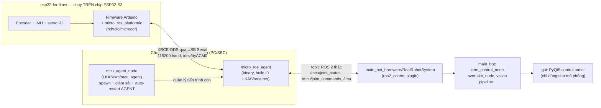

<div align="center">

# fullstack-LKAS

**Repo "fullstack" cho hệ thống LKAS: firmware ESP32 (PlatformIO) + workspace ROS 2, nối với nhau qua micro-ROS**

[](https://docs.ros.org/en/jazzy/)
[](https://micro.ros.org/)
[](https://platformio.org/)
[](#)
[](#)

</div>

---

## Mục lục

- [Tổng quan](#tổng-quan)
- [Kiến trúc tổng thể](#kiến-trúc-tổng-thể)
- [Cấu trúc repository](#cấu-trúc-repository)
- [Thành phần 1 — `esp32-for-lkas/` (firmware)](#thành-phần-1--esp32-for-lkas-firmware)
- [Thành phần 2 — `LKAS/` (ROS 2 workspace)](#thành-phần-2--lkas-ros-2-workspace)
- [Cầu nối micro-ROS hoạt động thế nào](#cầu-nối-micro-ros-hoạt-động-thế-nào)
- [Bắt đầu nhanh — chạy toàn bộ end-to-end](#bắt-đầu-nhanh--chạy-toàn-bộ-end-to-end)
- [Những điều dễ gây nhầm khi vận hành thật](#những-điều-dễ-gây-nhầm-khi-vận-hành-thật)
- [Trạng thái dự án](#trạng-thái-dự-án)
- [Giấy phép](#giấy-phép)

---

## Tổng quan

`fullstack-LKAS` gộp **2 codebase độc lập, chạy trên 2 phần cứng khác nhau**, cho cùng một robot Ackermann tự lái theo làn + tự vượt xe (chi tiết thuật toán xem [`LKAS/README.md`](LKAS/README.md)):

| Tầng | Chạy ở đâu | Ngôn ngữ/framework | Việc chính |
|---|---|---|---|
| **Firmware** | ESP32-S3 (vi điều khiển) | C++ / Arduino / PlatformIO | Đọc encoder, IMU; điều khiển động cơ + servo lái; nói chuyện với PC qua **micro-ROS** |
| **Ứng dụng** | PC / SBC (Linux) | C++ / Python / ROS 2 Jazzy | Thị giác máy tính, điều khiển Stanley, state machine vượt xe, mô phỏng Gazebo, GUI |

Hai tầng này **không giao tiếp trực tiếp** — ở giữa là một tiến trình cầu nối bắt buộc (`micro_ros_agent`), dịch giao thức nhị phân XRCE-DDS mà ESP32 nói, sang topic ROS 2 thật mà các node C++/Python ở tầng ứng dụng hiểu. Phần lớn nội dung tài liệu này giải thích **chính xác cầu nối đó hoạt động ra sao**, vì đây là phần dễ gây nhầm lẫn nhất khi mới tiếp cận repo.

## Kiến trúc tổng thể



Ba mảnh ghép **bắt buộc phải đúng cùng lúc** thì dữ liệu mới chảy từ cảm biến trên board tới node điều khiển:

1. Firmware ESP32 phải publish/subscribe **đúng tên topic + đúng kiểu message** mà `RealRobotSystem` mong đợi (xem [hợp đồng topic](#thành-phần-2--lkas-ros-2-workspace) bên dưới).
2. `micro_ros_agent` phải đang chạy, trỏ đúng cổng serial + baud rate mà firmware dùng.
3. Phía đọc dữ liệu (dù là `ros2 topic echo` để test hay `RealRobotSystem` khi chạy robot thật) phải đứng **đúng `ROS_DOMAIN_ID`** với agent — xem mục [gotcha](#những-điều-dễ-gây-nhầm-khi-vận-hành-thật).

## Cấu trúc repository

```
fullstack-LKAS/
├── esp32-for-lkas/          # Firmware ESP32 — PlatformIO project
│   ├── platformio.ini       # board=esp32-s3-devkitc1-n16r8, framework=arduino, lib micro_ros_platformio
│   ├── HARDWARE.md          # Sơ đồ đấu nối, quy hoạch GPIO, workflow bring-up/hiệu chuẩn
│   ├── include/              # robot_config.hpp (pin/gain), robot_types.hpp, header từng module
│   ├── src/                  # main.cpp (wiring) + drive_motor / steering_actuator / imu_sensor / micro_ros_bridge
│   └── fix_matter_ccflags.py # Patch build-time bắt buộc (xem giải thích trong file)
│
└── LKAS/                    # Workspace ROS 2 (colcon) — xem LKAS/README.md để biết chi tiết
    └── src/
        ├── main_bot/         # Pipeline giữ làn + vượt xe, mô tả robot, launch sim & robot thật
        ├── mcu_agent/        # Giám sát tiến trình micro_ros_agent cho robot thật
        ├── gui/              # PyQt5 control panel (chỉ dùng cho mô phỏng Gazebo)
        ├── micro_ros_setup/  # (gitignored) script build-time, tải về khi chạy setup 1 lần
        └── uros/             # (gitignored) source + build của micro_ros_agent thật
```

> `micro_ros_setup/` và `uros/` **không nằm trong git** (xem `.gitignore` gốc) — chúng là sản phẩm trung gian của bước setup một lần (`bash LKAS/src/mcu_agent/scripts/setup_micro_ros_agent.sh`), tự tái tạo được trên máy khác, không phải code của dự án.

## Thành phần 1 — `esp32-for-lkas/` (firmware)

PlatformIO project, board **ESP32-S3-DevKitC-1 N16R8** (16MB flash / 8MB PSRAM), framework Arduino.

- **Thư viện**: [`micro_ros_platformio`](https://github.com/micro-ROS/micro_ros_platformio) — build sẵn `rcl`/`rclc`/`microcdr` thành `libmicroros`, cho phép gọi API ROS 2 chuẩn (`rcl_publish`, `rclc_executor_spin_some`...) ngay trên vi điều khiển.
- **`fix_matter_ccflags.py`**: patch bắt buộc, không tuỳ chọn. Core Arduino-ESP32 hiện tại (đi kèm thành phần ESP-Matter) chèn một cờ biên dịch chứa `<...>` khiến CMake nội bộ của `micro_ros_platformio` sinh lỗi cú pháp shell (`Syntax error: ";" unexpected`) — không có patch này thì **firmware không build được**, không liên quan gì tới logic micro-ROS.
- **Firmware sản phẩm, đã implement đúng hợp đồng topic** ở [`LKAS/src/mcu_agent/README.md`](LKAS/src/mcu_agent/README.md): publish `sensor_msgs/msg/JointState` lên `/mcu/joint_states` + `sensor_msgs/msg/Imu` lên `/imu`, subscribe `sensor_msgs/msg/JointState` từ `/mcu/joint_commands`. Khung gầm Ackermann: 1 servo lái (tỷ số 1:1 cho 2 bánh trước) + 2 động cơ DC có encoder (bánh sau, đóng vòng PID vận tốc) + 1 IMU MPU6050. Code tách theo module (`drive_motor`, `steering_actuator`, `imu_sensor`, `micro_ros_bridge`, `pid_controller`) — chi tiết đấu nối phần cứng + workflow hiệu chuẩn xem [`HARDWARE.md`](esp32-for-lkas/HARDWARE.md).

## Thành phần 2 — `LKAS/` (ROS 2 workspace)

Đây là workspace ROS 2 Jazzy đầy đủ, xử lý toàn bộ tầng ứng dụng: thị giác (segmentation làn đường bằng ONNX), điều khiển Stanley, state machine vượt xe 4 trạng thái, mô phỏng Gazebo Harmonic, và GUI PyQt5. **Chi tiết kiến trúc/thuật toán/tham số tinh chỉnh xem trực tiếp tại [`LKAS/README.md`](LKAS/README.md)** — tài liệu đó đã rất đầy đủ, không lặp lại ở đây.

Riêng phần liên quan trực tiếp tới firmware ESP32 là package **`mcu_agent`**, có 2 việc, không hơn:

1. Spawn + giám sát tiến trình `micro_ros_agent` (tự khởi động lại nếu chết/USB rớt).
2. Publish `/mcu/agent/status` (`std_msgs/Bool`) để phần còn lại của hệ thống biết cầu nối ESP32 có đang sống không.

`mcu_agent_node` **không tự đọc/hiểu dữ liệu cảm biến** — nó chỉ canh tiến trình `micro_ros_agent` sống hay chết, không biết bên trong đang truyền topic gì.

## Cầu nối micro-ROS hoạt động thế nào

Đây là phần cốt lõi hay bị hiểu nhầm nhất, nên tách riêng giải thích rõ.

### Không phải "gửi raw string qua UART"

Byte chạy qua USB serial giữa ESP32 và PC **không tuỳ tiện** — nó tuân theo đặc tả nhị phân chính thức **DDS-XRCE** (OMG), gồm 2 lớp:

1. **Khung (framing)**: mỗi gói có sync byte, độ dài, CRC để agent biết ranh giới từng gói và kiểm tra toàn vẹn.
2. **Submessage bên trong khung**: `CREATE_CLIENT`, `CREATE_PARTICIPANT`, `CREATE_TOPIC`, `CREATE_PUBLISHER`, `CREATE_DATAWRITER`, `WRITE_DATA`... — đây là tên gọi chính thức trong spec XRCE-DDS, không phải log tự đặt. Payload thật của message (bên trong `WRITE_DATA`) được serialize theo **CDR** — cùng định dạng nhị phân mà DDS/ROS 2 desktop dùng.

Vì lý do đó, firmware **bắt buộc** phải dùng thư viện micro-ROS chuẩn (`rcl`/`rclc`/`microcdr` trong `micro_ros_platformio`) — không thể tự viết `Serial.print()` một chuỗi tuỳ ý rồi mong `micro_ros_agent` hiểu được, giống như không thể gửi byte bừa tới web server và mong nó tự hiểu như HTTP.

### Vai trò từng mảnh — cái nào thực sự "chạm" vào dữ liệu

| Thành phần | Chạy ở đâu | Có xử lý dữ liệu thật không? |
|---|---|---|
| `libmicroros` (trong firmware, từ `micro_ros_platformio`) | ESP32 | **Có** — encode dữ liệu thành khung XRCE-DDS + CDR trước khi gửi |
| **`micro_ros_agent`** (binary, build từ `LKAS/src/uros/micro-ROS-Agent`) | PC | **Có — đây là nơi duy nhất decode byte thật từ vi điều khiển**, dịch sang DDS thật |
| `micro_ros_setup` (`LKAS/src/micro_ros_setup`) | PC, chỉ lúc build | Không — chỉ là script tải/build ra `micro_ros_agent`, không chạy lúc runtime |
| `mcu_agent_node` (`LKAS/src/mcu_agent`) | PC | Không — chỉ start/stop/theo dõi tiến trình `micro_ros_agent` như một process con, không biết nội dung topic |

Nói ngắn gọn: nếu xoá `micro_ros_setup` và `mcu_agent_node` nhưng giữ nguyên binary `micro_ros_agent` đã build và tự tay chạy đúng lệnh, hệ thống vẫn hoạt động — vì chỉ `micro_ros_agent` là nơi thật sự xử lý dữ liệu.

## Bắt đầu nhanh — chạy toàn bộ end-to-end

```bash
# 1. Build + nạp firmware cho ESP32
cd esp32-for-lkas
pio run -t upload

# 2. Build micro_ros_agent (chỉ cần làm 1 lần, cần sudo cho rosdep)
cd ../LKAS
source /opt/ros/jazzy/setup.bash
bash src/mcu_agent/scripts/setup_micro_ros_agent.sh
# Nếu rosdep báo lỗi vì package main_bot (gz-msgs10) không liên quan tới ESP32,
# chạy scoped: rosdep install --from-paths src/micro_ros_setup --ignore-src -y
# rồi tự chạy tiếp các bước còn lại của script (xem nội dung script).

# 3. Build workspace ROS 2
colcon build
source install/setup.bash

# 4a. Chạy agent thủ công để test nhanh...
ros2 run micro_ros_agent micro_ros_agent serial --dev /dev/ttyACM0 -b 115200

# 4b. ...hoặc bringup đầy đủ robot thật (dùng mcu_agent_node + toàn bộ pipeline)
ros2 launch main_bot robot.launch.py serial_port:=/dev/ttyACM0 baud_rate:=115200
```

## Những điều dễ gây nhầm khi vận hành thật

Đúc kết từ quá trình dựng + test cầu nối micro-ROS trên chính máy dev này — không hiển nhiên, dễ khiến tưởng nhầm là "không kết nối được" dù mọi thứ đều đúng:

- **`ROS_DOMAIN_ID` của `micro_ros_agent` mặc định là `0`**, không theo biến môi trường `ROS_DOMAIN_ID` mà bạn set trong shell profile. Nếu máy bạn set domain khác (vd `7`), `ros2 topic echo`/mọi tool ROS 2 khác sẽ **không thấy topic từ agent** dù agent log báo `session established` + `datawriter created` hoàn toàn bình thường. Luôn kiểm tra bằng `ROS_DOMAIN_ID=0 ros2 topic list` nếu nghi ngờ.
- **Firmware không được phép "thử kết nối 1 lần rồi thôi"**: agent hiếm khi đã sẵn sàng đúng lúc board boot. Firmware phải chạy state machine `WAITING_AGENT → AGENT_AVAILABLE → AGENT_CONNECTED → AGENT_DISCONNECTED` (dùng `rmw_uros_ping_agent` để dò), không phải gọi `rclc_support_init` một lần trong `setup()` rồi bó tay nếu thất bại.
- **Health-check ping phải giãn cách (≥300–500ms), không ping mỗi vòng lặp**: ping quá dày tranh chấp với chính đường serial đang publish dữ liệu, khiến agent liên tục tưởng client rớt kết nối rồi tạo/xoá session lặp vô hạn (~1 lần/giây), không bao giờ ổn định dù về bản chất kết nối vẫn tốt.
- **Chỉ một tiến trình được giữ cổng serial tại một thời điểm** — nếu vừa `pio run -t upload`/`pio device monitor` vừa chạy `micro_ros_agent` cùng lúc trên cùng cổng, một bên sẽ mất kết nối. Dừng agent trước khi nạp firmware mới.
- **`rosdep install --from-paths src ...` trong `setup_micro_ros_agent.sh` quét toàn bộ `LKAS/src`**, có thể vướng dependency của package không liên quan (vd `main_bot` cần `gz-msgs10` chưa resolve được) — nếu chỉ cần build agent, scope rosdep lại `src/micro_ros_setup` để né.

## Trạng thái dự án

- ✅ Firmware build được, patch toolchain đã áp dụng, kết nối agent ổn định, đã test link micro-ROS thật trên board qua `/dev/ttyACM0`.
- ✅ Firmware đã implement đúng hợp đồng topic (`/mcu/joint_states`, `/mcu/joint_commands`, `/imu`), tách module rõ ràng — xem [`HARDWARE.md`](esp32-for-lkas/HARDWARE.md).
- ⚠️ **Chưa test trên phần cứng thật** (servo/động cơ/encoder/IMU chưa gắn vào board lúc viết code) — pin/gain trong `robot_config.hpp` là placeholder cần đo/calibrate theo đúng robot, theo quy trình ở `HARDWARE.md`.
- ⚠️ Driver camera/LiDAR thật trong `LKAS/src/main_bot/launch/practical/robot.launch.py` hiện là placeholder, cần điền node đúng phần cứng thật đang dùng.
- ⚠️ Chưa khai báo giấy phép chính thức cho `main_bot` (`package.xml` còn để `TODO`).

## Giấy phép

Chưa khai báo giấy phép chính thức cho toàn repo. Vui lòng bổ sung `LICENSE` trước khi phát hành công khai.

---

<div align="center">

Được duy trì bởi [DangTinhPat](https://github.com/DangTinhPat) · ROS 2 Jazzy · micro-ROS · PlatformIO ESP32-S3

</div>
