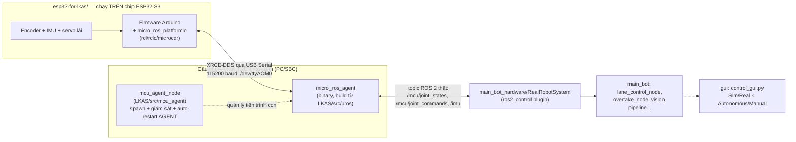

<div align="center">

# fullstack-LKAS

**Firmware ESP32 (PlatformIO) + workspace ROS 2, nối với nhau qua micro-ROS, cho một hệ thống LKAS chạy được cả mô phỏng lẫn robot thật.**

[](https://docs.ros.org/en/jazzy/)
[](https://micro.ros.org/)
[](https://platformio.org/)
[](#)
[](#)

</div>

---

## Demo

[▶ Video mô phỏng — giữ làn + vượt xe trên Gazebo](demo/demo_sim_lkas.mp4)

Chi tiết thuật toán, kiến trúc pipeline và tham số điều khiển: [`LKAS/README.md`](LKAS/README.md).

## Mục lục

- [Tổng quan](#tổng-quan)
- [Kiến trúc tổng thể](#kiến-trúc-tổng-thể)
- [Cấu trúc repository](#cấu-trúc-repository)
- [Thành phần 1 — `esp32-for-lkas/` (firmware)](#thành-phần-1--esp32-for-lkas-firmware)
- [Thành phần 2 — `LKAS/` (ROS 2 workspace)](#thành-phần-2--lkas-ros-2-workspace)
- [Cầu nối micro-ROS](#cầu-nối-micro-ros)
- [Bắt đầu nhanh](#bắt-đầu-nhanh)
- [Vận hành thật — các điểm cần biết](#vận-hành-thật--các-điểm-cần-biết)
- [Trạng thái dự án](#trạng-thái-dự-án)
- [Giấy phép](#giấy-phép)

---

## Tổng quan

`fullstack-LKAS` gồm 2 codebase độc lập, chạy trên 2 phần cứng khác nhau, phục vụ cùng một robot Ackermann tự lái theo làn và tự vượt xe:

| Tầng | Chạy ở đâu | Ngôn ngữ/framework | Việc chính |
|---|---|---|---|
| Firmware | ESP32-S3 (vi điều khiển) | C++ / Arduino / PlatformIO | Đọc encoder, IMU; điều khiển động cơ + servo lái; giao tiếp với PC qua micro-ROS |
| Ứng dụng | PC / SBC (Linux) | C++ / Python / ROS 2 Jazzy | Thị giác máy tính, điều khiển Stanley, state machine vượt xe, mô phỏng Gazebo, GUI |

Hai tầng không giao tiếp trực tiếp. Ở giữa là `micro_ros_agent`, dịch giao thức nhị phân XRCE-DDS mà ESP32 nói sang topic ROS 2 mà các node C++/Python ở tầng ứng dụng đọc được. Phần [Cầu nối micro-ROS](#cầu-nối-micro-ros) mô tả chi tiết cơ chế này.

## Kiến trúc tổng thể



Ba điều kiện sau phải đúng cùng lúc thì dữ liệu mới chảy từ cảm biến trên board tới node điều khiển:

1. Firmware ESP32 publish/subscribe đúng tên topic và đúng kiểu message mà `RealRobotSystem` mong đợi — xem [hợp đồng topic](#thành-phần-2--lkas-ros-2-workspace).
2. `micro_ros_agent` đang chạy, trỏ đúng cổng serial và baud rate mà firmware dùng.
3. Phía đọc dữ liệu (`ros2 topic echo` để test, hoặc `RealRobotSystem` khi chạy robot thật) đứng đúng `ROS_DOMAIN_ID` với agent — xem [Vận hành thật](#vận-hành-thật--các-điểm-cần-biết).

## Cấu trúc repository

```
fullstack-LKAS/
├── demo/                     # Video demo
│   └── demo_sim_lkas.mp4
│
├── esp32-for-lkas/           # Firmware ESP32 — PlatformIO project
│   ├── platformio.ini        # board=esp32-s3-devkitc1-n16r8, framework=arduino, lib micro_ros_platformio
│   ├── HARDWARE.md           # Sơ đồ đấu nối, quy hoạch GPIO, workflow bring-up/hiệu chuẩn
│   ├── include/               # robot_config.hpp (pin/gain), robot_types.hpp, header từng module
│   ├── src/                   # main.cpp (wiring) + drive_motor / steering_actuator / imu_sensor / micro_ros_bridge
│   └── fix_matter_ccflags.py  # Patch build-time bắt buộc (xem giải thích trong file)
│
└── LKAS/                     # Workspace ROS 2 (colcon) — xem LKAS/README.md để biết chi tiết
    └── src/
        ├── main_bot/          # Pipeline giữ làn + vượt xe, mô tả robot, launch sim & robot thật
        ├── mcu_agent/         # Giám sát tiến trình micro_ros_agent cho robot thật
        ├── gui/               # control_gui.py — 1 GUI, 4 chế độ: Sim/Real × Autonomous/Manual
        ├── micro_ros_setup/   # (gitignored) script build-time, tải về khi chạy setup 1 lần
        └── uros/              # (gitignored) source + build của micro_ros_agent thật
```

`micro_ros_setup/` và `uros/` không nằm trong git (xem `.gitignore` gốc) — chúng là sản phẩm trung gian của bước setup một lần (`bash LKAS/src/mcu_agent/scripts/setup_micro_ros_agent.sh`), tự tái tạo được trên máy khác.

## Thành phần 1 — `esp32-for-lkas/` (firmware)

PlatformIO project, board ESP32-S3-DevKitC-1 N16R8 (16MB flash / 8MB PSRAM), framework Arduino.

- **Thư viện**: [`micro_ros_platformio`](https://github.com/micro-ROS/micro_ros_platformio) build sẵn `rcl`/`rclc`/`microcdr` thành `libmicroros`, cho phép gọi API ROS 2 chuẩn (`rcl_publish`, `rclc_executor_spin_some`...) trên vi điều khiển.
- **`fix_matter_ccflags.py`**: patch bắt buộc, không tuỳ chọn. Core Arduino-ESP32 hiện tại (đi kèm thành phần ESP-Matter) chèn một cờ biên dịch chứa `<...>` khiến CMake nội bộ của `micro_ros_platformio` sinh lỗi cú pháp shell (`Syntax error: ";" unexpected`). Không có patch này, firmware không build được — không liên quan tới logic micro-ROS.
- **Hợp đồng topic** implement đúng theo [`LKAS/src/mcu_agent/README.md`](LKAS/src/mcu_agent/README.md): publish `sensor_msgs/msg/JointState` lên `/mcu/joint_states` và `sensor_msgs/msg/Imu` lên `/imu`; subscribe `sensor_msgs/msg/JointState` từ `/mcu/joint_commands`. Khung gầm Ackermann: 1 servo lái (tỷ số 1:1 cho 2 bánh trước) + 2 động cơ DC có encoder (bánh sau, đóng vòng PID vận tốc) + 1 IMU MPU6050. Code tách theo module (`drive_motor`, `steering_actuator`, `imu_sensor`, `micro_ros_bridge`, `pid_controller`) — chi tiết đấu nối và workflow hiệu chuẩn xem [`HARDWARE.md`](esp32-for-lkas/HARDWARE.md).

## Thành phần 2 — `LKAS/` (ROS 2 workspace)

Workspace ROS 2 Jazzy xử lý toàn bộ tầng ứng dụng: thị giác (segmentation làn đường bằng ONNX), điều khiển Stanley, state machine vượt xe 4 trạng thái, mô phỏng Gazebo Harmonic, và GUI điều khiển. Kiến trúc/thuật toán/tham số tinh chỉnh: [`LKAS/README.md`](LKAS/README.md).

Phần liên quan trực tiếp tới firmware ESP32 là package `mcu_agent`, có đúng 2 việc:

1. Spawn và giám sát tiến trình `micro_ros_agent` (tự khởi động lại nếu chết hoặc USB rớt).
2. Publish `/mcu/agent/status` (`std_msgs/Bool`) để phần còn lại của hệ thống biết cầu nối ESP32 có đang sống không.

`mcu_agent_node` không đọc/hiểu dữ liệu cảm biến — nó chỉ canh tiến trình `micro_ros_agent` sống hay chết.

## Cầu nối micro-ROS

Byte chạy qua USB serial giữa ESP32 và PC tuân theo đặc tả nhị phân **DDS-XRCE** (OMG), gồm 2 lớp:

1. **Khung (framing)**: mỗi gói có sync byte, độ dài, CRC để agent xác định ranh giới gói và kiểm tra toàn vẹn.
2. **Submessage bên trong khung**: `CREATE_CLIENT`, `CREATE_PARTICIPANT`, `CREATE_TOPIC`, `CREATE_PUBLISHER`, `CREATE_DATAWRITER`, `WRITE_DATA`... — tên gọi chính thức trong spec XRCE-DDS. Payload thật (bên trong `WRITE_DATA`) được serialize theo CDR, cùng định dạng nhị phân mà DDS/ROS 2 desktop dùng.

Vì vậy firmware bắt buộc dùng thư viện micro-ROS chuẩn (`rcl`/`rclc`/`microcdr` trong `micro_ros_platformio`) thay vì tự ghép chuỗi byte và mong `micro_ros_agent` hiểu được.

**Vai trò từng mảnh — nơi nào thực sự xử lý dữ liệu:**

| Thành phần | Chạy ở đâu | Xử lý dữ liệu thật? |
|---|---|---|
| `libmicroros` (trong firmware, từ `micro_ros_platformio`) | ESP32 | Có — encode dữ liệu thành khung XRCE-DDS + CDR trước khi gửi |
| `micro_ros_agent` (binary, build từ `LKAS/src/uros/micro-ROS-Agent`) | PC | Có — nơi duy nhất decode byte thật từ vi điều khiển, dịch sang DDS thật |
| `micro_ros_setup` (`LKAS/src/micro_ros_setup`) | PC, chỉ lúc build | Không — script tải/build ra `micro_ros_agent`, không chạy lúc runtime |
| `mcu_agent_node` (`LKAS/src/mcu_agent`) | PC | Không — chỉ start/stop/theo dõi tiến trình `micro_ros_agent` như một process con |

Nếu xoá `micro_ros_setup` và `mcu_agent_node` nhưng giữ nguyên binary `micro_ros_agent` đã build và tự chạy đúng lệnh, hệ thống vẫn hoạt động — chỉ `micro_ros_agent` thật sự xử lý dữ liệu.

## Bắt đầu nhanh

```bash
# 1. Build + nạp firmware cho ESP32
cd esp32-for-lkas
pio run -t upload

# 2. Build micro_ros_agent (chỉ cần làm 1 lần, cần sudo cho rosdep)
cd ../LKAS
source /opt/ros/jazzy/setup.bash
bash src/mcu_agent/scripts/setup_micro_ros_agent.sh
# Nếu rosdep báo lỗi vì package main_bot (gz-msgs10) không liên quan tới ESP32,
# scope lại: rosdep install --from-paths src/micro_ros_setup --ignore-src -y
# rồi tiếp tục các bước còn lại của script.

# 3. Build workspace ROS 2
colcon build
source install/setup.bash

# 4a. Chạy agent thủ công để test nhanh...
ros2 run micro_ros_agent micro_ros_agent serial --dev /dev/ttyACM0 -b 115200

# 4b. ...hoặc bringup đầy đủ robot thật (mcu_agent_node + toàn bộ pipeline)
ros2 launch main_bot robot.launch.py serial_port:=/dev/ttyACM0 baud_rate:=115200
```

## Vận hành thật — các điểm cần biết

- **`ROS_DOMAIN_ID` của `micro_ros_agent` mặc định là `0`**, không theo biến môi trường `ROS_DOMAIN_ID` set trong shell profile. Nếu máy bạn set domain khác, `ros2 topic echo` và mọi tool ROS 2 khác sẽ không thấy topic từ agent dù log agent báo `session established` + `datawriter created` bình thường. Kiểm tra bằng `ROS_DOMAIN_ID=0 ros2 topic list` nếu nghi ngờ.
- **Firmware không được thử kết nối một lần rồi thôi** — agent hiếm khi sẵn sàng đúng lúc board boot. Firmware chạy state machine `WAITING_AGENT → AGENT_AVAILABLE → AGENT_CONNECTED → AGENT_DISCONNECTED` (dò bằng `rmw_uros_ping_agent`), không gọi `rclc_support_init` một lần trong `setup()` rồi bỏ cuộc nếu thất bại.
- **Health-check ping phải giãn cách (≥300–500ms)**, không ping mỗi vòng lặp — ping quá dày tranh chấp với đường serial đang publish dữ liệu, khiến agent liên tục tưởng client rớt kết nối rồi tạo/xoá session lặp lại, không bao giờ ổn định dù kết nối vẫn tốt.
- **Chỉ một tiến trình được giữ cổng serial tại một thời điểm** — nếu vừa `pio run -t upload`/`pio device monitor` vừa chạy `micro_ros_agent` trên cùng cổng, một bên sẽ mất kết nối. Dừng agent trước khi nạp firmware mới.
- **`rosdep install --from-paths src ...` trong `setup_micro_ros_agent.sh` quét toàn bộ `LKAS/src`**, có thể vướng dependency của package không liên quan (ví dụ `main_bot` cần `gz-msgs10` chưa resolve được). Nếu chỉ cần build agent, scope rosdep lại `src/micro_ros_setup`.

## Trạng thái dự án

Đã kiểm chứng end-to-end trên robot thật, bao gồm lane-keeping tự hành — không còn dừng ở mô phỏng. Chuỗi firmware ESP32 → `micro_ros_agent` → `mcu_agent` → `RealRobotSystem` → `ackermann_steering_controller` → pipeline thị giác/điều khiển/vượt xe đã chạy được trên phần cứng vật lý.

Trong quá trình đưa lên phần cứng thật, đã phát hiện và sửa một lỗi khớp lệnh: `RealRobotSystem` publish `/mcu/joint_commands` theo thứ tự khai báo joint trong `ros2_control.xacro`, trong khi firmware đọc theo chỉ số mảng cố định — hai bên không khớp nhau khiến lệnh lái/ga không tới nơi dù kết nối vẫn báo bình thường. Đã sửa bằng cách tra cứu theo tên joint ở cả hai chiều, không còn phụ thuộc thứ tự mảng.

GUI hợp nhất (`control_gui.py`) hỗ trợ 4 chế độ Sim/Real × Autonomous/Manual. Chế độ Manual (joystick) dùng để bench-test drivetrain bằng tay trước khi chạy tự hành, không tranh chấp `/cmd_vel` với pipeline tự lái.

Còn lại cần hoàn thiện:

- Pin/gain trong `robot_config.hpp` (tỷ số encoder, hệ số PID, dải góc servo) là giá trị ban đầu, chưa qua vòng hiệu chỉnh chính xác theo `HARDWARE.md`. Không ảnh hưởng tới việc robot chạy được, chỉ ảnh hưởng chất lượng bám làn và đáp ứng tốc độ.
- Node driver camera/LiDAR dùng khi test thật cần được commit chính thức vào [`launch/practical/robot.launch.py`](LKAS/src/main_bot/launch/practical/robot.launch.py) — file này hiện chỉ có ví dụ dạng comment.
- Chưa khai báo giấy phép chính thức cho `main_bot` (`package.xml` còn để `TODO`).

## Giấy phép

Chưa khai báo giấy phép chính thức cho toàn repo. Bổ sung `LICENSE` trước khi phát hành công khai.

---

<div align="center">

Được duy trì bởi [DangTinhPat](https://github.com/DangTinhPat) · ROS 2 Jazzy · micro-ROS · PlatformIO ESP32-S3

</div>
