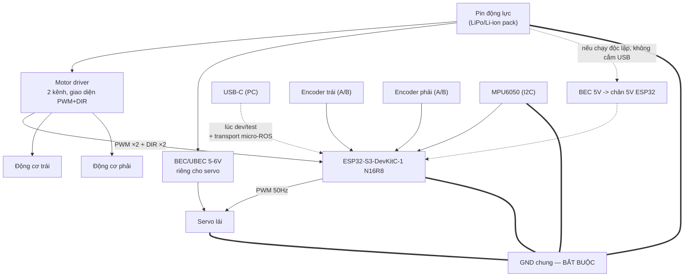
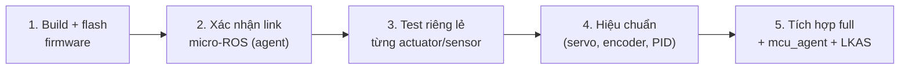

<div align="center">

# esp32-for-lkas — Hardware & Bring-up Guide

**Sơ đồ đấu nối, quy hoạch GPIO, và quy trình vận hành firmware micro-ROS cho khung gầm Ackermann**

[](#)
[](#quy-hoạch-gpio)
[](https://micro.ros.org/)

</div>

---

## Mục lục

- [Cấu hình khung gầm](#cấu-hình-khung-gầm)
- [Kiến trúc điện tổng thể](#kiến-trúc-điện-tổng-thể)
- [Quy hoạch GPIO](#quy-hoạch-gpio)
- [Đấu nối chi tiết từng khối](#đấu-nối-chi-tiết-từng-khối)
- [Checklist an toàn trước khi cấp nguồn lần đầu](#checklist-an-toàn-trước-khi-cấp-nguồn-lần-đầu)
- [Workflow phát triển & bring-up](#workflow-phát-triển--bring-up)
- [Quy trình hiệu chuẩn](#quy-trình-hiệu-chuẩn)
- [Bảo trì & mở rộng](#bảo-trì--mở-rộng)

---

## Cấu hình khung gầm

| Cụm | Số lượng | Vai trò |
|---|---|---|
| Servo lái | 1 | Dẫn động 2 bánh trước qua tay đòn cơ khí, tỷ số **1:1** — firmware chỉ xử lý **1 góc lái duy nhất** |
| Động cơ DC + encoder | 2 | Đẩy lực 2 bánh sau độc lập, đóng vòng vận tốc bằng **PID** trên encoder |
| IMU | 1 × MPU6050 | Đọc gia tốc + vận tốc góc, giao tiếp I2C |
| MCU | ESP32-S3-DevKitC-1 **N16R8** | 16MB Quad Flash + **8MB Octal PSRAM**, USB-CDC gốc |

Toàn bộ logic điều khiển tương ứng nằm ở [`include/robot_config.hpp`](include/robot_config.hpp) (pin + hằng số) và [`src/drive_motor.cpp`](src/drive_motor.cpp) / [`src/steering_actuator.cpp`](src/steering_actuator.cpp) / [`src/imu_sensor.cpp`](src/imu_sensor.cpp) (driver từng khối). Tài liệu này chỉ nói phần **điện — dây nối vào đâu, vì sao chọn chân đó, và thứ tự bật máy/hiệu chuẩn an toàn**.

## Kiến trúc điện tổng thể



> **GND chung là điều kiện bắt buộc, không phải tuỳ chọn.** Mọi tín hiệu PWM/DIR/encoder/I2C đều là mức điện áp so với GND — nếu pin động lực, driver, servo và ESP32 không chung một điểm GND, tín hiệu đọc được sẽ trôi hoặc sai hoàn toàn, kể cả khi nhìn bằng mắt vẫn "có vẻ chạy".

## Quy hoạch GPIO

Board dùng **Octal PSRAM (N16R8)** — đây là ràng buộc phần cứng quan trọng nhất khi chọn chân, khác với board ESP32 cổ điển hay ESP32-S3 bản Quad PSRAM thông thường.

<table>
<tr><th colspan="3">🔴 Vùng cấm tuyệt đối — dành cho bus PSRAM/Flash nội bộ</th></tr>
<tr><td colspan="3">

**GPIO 26 – 37** — không đấu bất kỳ tín hiệu nào vào dải này. Đấu nhầm vào đây thường khiến board treo lúc boot hoặc PSRAM báo lỗi ngẫu nhiên (rất khó debug vì triệu chứng không rõ ràng, dễ nhầm là lỗi code).

</td></tr>
<tr><th colspan="3">🟡 Vùng cần tránh — strapping pin / đã có chức năng cố định</th></tr>
<tr><td width="20%"><b>GPIO 0, 3, 45, 46</b></td><td width="40%">Strapping pin (boot mode, VDD_SPI, ROM log)</td><td>Kéo mức sai lúc reset có thể khiến board không boot được</td></tr>
<tr><td><b>GPIO 19, 20</b></td><td>USB D-/D+</td><td>Đang dùng cho USB-CDC gốc — cổng transport của micro-ROS, không được dùng lại</td></tr>
<tr><td><b>GPIO 48</b></td><td>WS2812 RGB LED onboard</td><td>Để dành cho LED trạng thái sau này nếu cần, hiện chưa dùng trong firmware</td></tr>
</table>

**Bảng phân bổ chân thực tế** (đã build và verify compile — xem [`robot_config.hpp`](include/robot_config.hpp)):

| Chức năng | GPIO | Loại tín hiệu | Ghi chú |
|---|---|---|---|
| Servo lái — PWM | **13** | Output, 50Hz PWM | 1 servo, tỷ số cơ khí 1:1 với 2 bánh trước |
| Động cơ trái — PWM (tốc độ) | **4** | Output, 20kHz PWM | LEDC hardware PWM |
| Động cơ trái — DIR (chiều) | **5** | Output, digital | HIGH/LOW theo dấu vận tốc |
| Encoder trái — kênh A | **6** | Input, digital | Đọc bằng PCNT phần cứng (`ESP32Encoder`) |
| Encoder trái — kênh B | **7** | Input, digital | |
| Động cơ phải — PWM (tốc độ) | **15** | Output, 20kHz PWM | |
| Động cơ phải — DIR (chiều) | **16** | Output, digital | |
| Encoder phải — kênh A | **17** | Input, digital | |
| Encoder phải — kênh B | **18** | Input, digital | |
| IMU — SDA | **8** | I2C data | Chân I2C mặc định phổ biến trên board S3 |
| IMU — SCL | **9** | I2C clock | |

Tất cả các chân trên đều nằm ngoài vùng 26–37 và ngoài nhóm strapping — an toàn để dùng tự do.

## Đấu nối chi tiết từng khối

### 1. Nguồn

- **Motor driver**: cấp trực tiếp từ pin động lực (VM/VCC motor), **không** qua ESP32.
- **Servo**: cấp từ BEC/UBEC 5–6V **riêng biệt**, không lấy từ chân 5V trên ESP32 dev board — dòng khởi động của servo (stall current) thường vượt xa khả năng của mạch nguồn nhỏ trên board dev, dễ gây brown-out reset MCU ngay lúc servo hoạt động mạnh.
- **ESP32-S3**: cấp qua USB-C lúc dev/test; khi vận hành độc lập không cắm PC, dùng một BEC 5V riêng nối vào chân `5V`/`VIN` của board.

### 2. Motor driver (giả định giao diện 2 dây PWM + DIR)

Firmware hiện tại (`drive_motor.cpp`) điều khiển mỗi động cơ bằng đúng **2 tín hiệu**: 1 PWM (độ lớn tốc độ) + 1 DIR (chiều quay) — khớp với các driver kiểu **Cytron MD10C/MDD10A** hoặc tương đương dùng giao diện PWM+DIR trực tiếp.

> Nếu driver bạn có là loại 3 dây kinh điển (TB6612FNG, L298N với `IN1`/`IN2`/`PWM` riêng biệt), nối `DIR` vào `IN1`, và **cố định `IN2` xuống GND** — lúc đó chỉ quay được 1 chiều. Muốn đảo chiều đầy đủ với driver 3 dây, cần sửa thêm 1 chân `IN2` trong `drive_motor.cpp` (không có sẵn trong bản hiện tại).

| Driver | ESP32-S3 |
|---|---|
| `PWMA` / `PWM` (trái) | GPIO4 |
| `DIR`/`AIN` (trái) | GPIO5 |
| `PWMB` / `PWM` (phải) | GPIO15 |
| `DIR`/`BIN` (phải) | GPIO16 |
| `GND` | GND chung |
| `VM` (nguồn động lực) | Pin động lực (**không** nối vào ESP32) |

### 3. Encoder (2 kênh A/B mỗi bên)

> ⚠️ **Kiểm tra mức điện áp output của encoder trước khi đấu.** GPIO của ESP32-S3 chỉ chịu tối đa 3.3V — nếu Hall sensor trên động cơ được cấp nguồn 5V/6V/12V và xuất tín hiệu ở mức tương ứng, phải hạ áp bằng cầu phân áp điện trở hoặc IC level-shifter trước khi đưa vào GPIO. Đưa thẳng 5V vào chân input có thể làm hỏng GPIO vĩnh viễn.

| Encoder trái | ESP32-S3 | Encoder phải | ESP32-S3 |
|---|---|---|---|
| Kênh A | GPIO6 | Kênh A | GPIO17 |
| Kênh B | GPIO7 | Kênh B | GPIO18 |
| VCC (theo datasheet động cơ) | Nguồn logic phù hợp | VCC | như trái |
| GND | GND chung | GND | như trái |

### 4. Servo lái

| Servo | ESP32-S3 |
|---|---|
| Signal | GPIO13 |
| VCC | BEC 5–6V riêng |
| GND | GND chung |

### 5. IMU MPU6050 (I2C)

| MPU6050 | ESP32-S3 |
|---|---|
| SDA | GPIO8 |
| SCL | GPIO9 |
| VCC | 3.3V (MPU6050 breakout thường có sẵn regulator 3.3V trên board — không cấp 5V trực tiếp vào chân VCC của IC nếu breakout không có regulator) |
| GND | GND chung |

## Checklist an toàn trước khi cấp nguồn lần đầu

1. Đo thông mạch GND giữa pin động lực, driver, servo BEC, và ESP32 — xác nhận chung 1 điểm.
2. Cấp nguồn động lực (pin) **trước khi** cắm USB — tránh trường hợp driver/servo cấp ngược dòng vào mạch 5V của cổng USB máy tính.
3. Chưa gắn bánh/động cơ vào khung lúc test phần mềm lần đầu — treo bánh tự do, tránh robot tự chạy mất kiểm soát nếu PID/hướng encoder sai lúc đầu.
4. Kiểm tra chiều quay servo bằng tay (xoay nhẹ, không cấp lực) trước khi cấp PWM, đảm bảo không kẹt cơ khí ở hai đầu hành trình.

## Workflow phát triển & bring-up

Thứ tự dưới đây tối thiểu hoá rủi ro — không nhảy thẳng vào chạy full robot khi chưa xác nhận từng lớp hoạt động đúng.



1. **Build + flash**
   ```bash
   cd esp32-for-lkas
   pio run -t upload
   ```

2. **Xác nhận link micro-ROS** — chạy agent thủ công, xem `ros2 topic list`/`echo` thấy `/mcu/joint_states`, `/imu` (nhớ `ROS_DOMAIN_ID` khớp — mặc định agent dùng domain `0`).

3. **Test riêng lẻ từng khối** — trước khi tin `main.cpp` chạy đúng full, nên tạm thời cô lập từng phần (ví dụ publish `target_speed` nhỏ cho 1 bánh, quan sát `measuredVelocity()` qua `/mcu/joint_states` có đúng dấu/độ lớn kỳ vọng không) trước khi ráp cả 2 bánh + servo cùng lúc.

4. **Hiệu chuẩn** — xem mục kế tiếp.

5. **Tích hợp full** — chạy `ros2 launch main_bot robot.launch.py` (bật `mcu_agent_node`, `RealRobotSystem`, toàn bộ pipeline điều khiển).

## Quy trình hiệu chuẩn

Thực hiện đúng thứ tự — mỗi bước sau phụ thuộc bước trước đã đúng:

1. **Servo lái**: gửi `steer_angle_rad = 0`, đo góc bánh thật bằng mắt/thước đo — chỉnh cơ khí (rod end) cho tới khi 0 rad = bánh thẳng. Sau đó gửi `±0.52 rad`, xác nhận không đụng giới hạn hành trình cơ khí trước khi đạt góc tối đa.
2. **Chiều encoder**: quay tay bánh trái theo chiều tiến, kiểm tra `measuredVelocity()` (qua `/mcu/joint_states`) ra **dương**. Nếu ra âm, đảo 2 dây kênh A/B của encoder đó (không cần sửa code).
3. **Chiều động cơ khớp chiều encoder**: gửi lệnh `rear_left_velocity_rad_s` dương nhỏ (vd 1.0), xác nhận bánh quay **đúng chiều tiến** và `measuredVelocity()` đọc về cũng dương (tức PID đang điều khiển đúng chiều, không chạy đua ngược dấu với phản hồi).
4. **Tune PID** (`kDriveKp/Ki/Kd` trong `robot_config.hpp`): bắt đầu từ giá trị hiện có, tăng dần `Kp` tới khi bánh bám setpoint nhanh nhưng không dao động, thêm `Ki` để triệt sai số xác lập, chỉ thêm `Kd` nếu thấy overshoot cần dập.
5. **IMU**: xác nhận trục — đặt robot nằm yên trên mặt phẳng, `linear_acceleration.z` phải ra ≈ 9.81 m/s² (trọng lực), `angular_velocity` cả 3 trục ≈ 0. Nếu trục sai hướng so với khung robot thật, cần map lại trong `imu_sensor.cpp` (đổi thứ tự/gán dấu trục) — đừng chỉnh phía `overtake`/`ekf.yaml` để bù, sẽ gây lệch ở lớp sai chỗ.

## Bảo trì & mở rộng

- **Đổi driver động cơ khác loại 2 dây PWM+DIR**: cần sửa `DriveMotor::writeMotor()` trong `drive_motor.cpp` để phát thêm tín hiệu theo giao diện driver mới, cập nhật bảng pin ở tài liệu này song song.
- **Thêm cảm biến mới** (camera/LiDAR thật gắn trực tiếp ESP32, hiếm khi cần vì 2 cảm biến đó thường nối thẳng PC): thêm 1 file `*_sensor.hpp/.cpp` theo đúng pattern của `imu_sensor`, không nhét logic đọc cảm biến vào `main.cpp`.
- **Đổi board sang biến thể PSRAM khác** (Quad thay vì Octal, hoặc không PSRAM): vùng GPIO cấm ở mục [Quy hoạch GPIO](#quy-hoạch-gpio) **không còn đúng** — phải tra lại datasheet của module cụ thể trước khi tái sử dụng file này.
